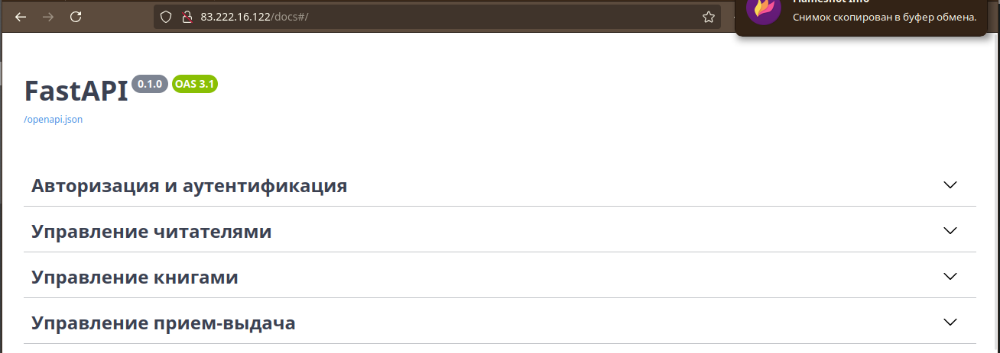

# Тестовое задание: API-сервис библиотека для Стажера Python-Разработчика: API для Библиотеки 

## Как запустить (2 варианта для запуска)

## Вариант №1. Локальный запуск
Hеобходимо склонировать код.

Скачайте код:
```sh
git@github.com:zatomis/RestApiForBook.git
```

Перейдите в каталог проекта:
```sh
cd RestApiForBook
```

Для запуска сайта необходимо наличие двух сервисов:
- `Redis`
- `Postgres`

Для этого запустите следующую команду, убедившись что у вас локально присутствует [Docker](https://docs.docker.com/engine/install/ubuntu/) 

```sh
docker compose -f docker-compose-local.yaml up -d
```
Будет создана БД, которая будет использоваться в качестве хранилища данных.

[Установите Python](https://www.python.org/), если этого ещё не сделали.

Проверьте, что `python` установлен и корректно настроен. Запустите его в командной строке:
```sh
python --version
```
**Важно!** Версия Python должна быть не ниже 3.11.

Возможно, вместо команды `python` здесь и в остальных инструкциях этого README придётся использовать `python3`. Зависит это от операционной системы.

В каталоге проекта создайте виртуальное окружение:
```sh
python -m venv venv
```
Активируйте его. На разных операционных системах это делается разными командами:

- Windows: `.\venv\Scripts\activate`
- MacOS/Linux: `source venv/bin/activate`


Установите зависимости в виртуальное окружение:
```sh
pip install -r requirements.txt
```

Определите переменные окружения. Создать файл `.env` в вашем каталоге. Пример заполнения полей значений файла см. в `.env-test`:
```sh
.env
```

Создайте базу данных PostgressSQL, отмигрировав её следующей командой:

```sh
alembic upgrade head
```

Запустите код:

```sh
python src/main.py
```

Откройте сайт в браузере по адресу [http://127.0.0.1:8000/docs](http://127.0.0.1:8000/docs).  
Вы должны увидеть страницу 



## Как запустить версию сайта на отдельном своём выделенное сервере

Для этого необходимо на вашем сервере склонировать код. 
Скачайте код:
```sh
git@github.com:zatomis/RestApiForBook.git
```

Перейдите в каталог проекта:
```sh
cd RestApiForBook
```
Проверьте, что [Docker](https://docs.docker.com/engine/install/ubuntu/) установлен и корректно настроен. Запустите его в командной строке:
```shell
docker --version
```
1. Создаем сеть
```sh
docker network create my_network
```
2. Остановите если у вас запущен nginx
```sh
systemctl stop nginx
```
3. Запустите nginx для вашего сервера командой
```sh
docker run --name library_nginx --volume ./nginx.conf:/etc/nginx/nginx.conf --network=my_network --rm -p 80:80 nginx
```
4. Запустите ваш сайт
```sh
docker compose up -d
```
Откройте сайт в браузере по адресу [http://IP-адрес-вашего-сервера:8000/docs](http://0.0.0.0:8000/docs).  

## Пример работы
Пример работы сайта доступно по [адресу](http://83.222.16.122/docs#/).

## Цели проекта
Код написан в учебно-тестовых целях. Полное описание к заданию см. в файле memory.txt
Дополнение по заданию см.в файле additions.txt


